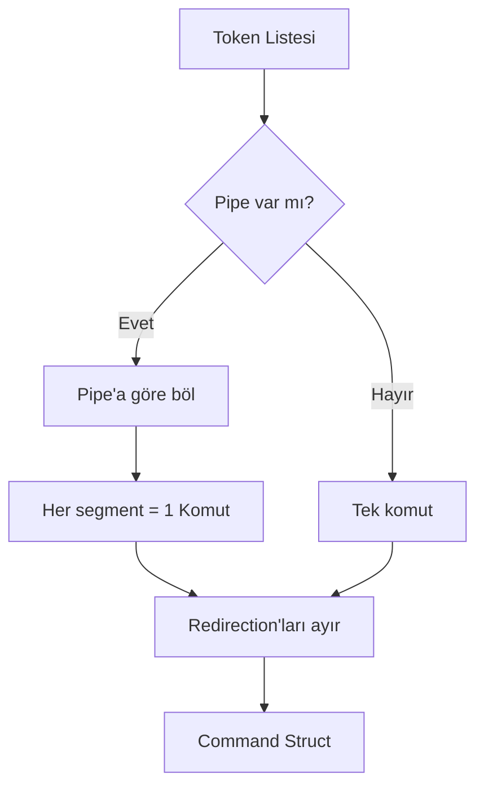

# 🐚 Minishell Program Akışı

> *Bash'in minimal ve şık bir yeniden yaratımı*

---

## 🔄 SONSUZ DÖNGÜ (The Infinite Loop)

Minishell temelinde sonsuz bir `while(1)` döngüsüdür ve sadece kullanıcı `exit` yazdığında veya belirli bir sinyal gönderdiğinde kırılır.


---

## 📖 ADIM 1: READ (Girdiyi Alma)

**Fonksiyon:** `readline()`

| Aşama | Açıklama |
|-------|----------|
| **Prompt** | Ekrana `minishell$ ` yaz ve bekle |
| **Input** | Kullanıcı bir komut yazar (string) |
| **History** | Eğer komut boş değilse, `add_history()` ile hafızaya ekle |
| **Signals** | `Ctrl+C` veya `Ctrl+D` tuşlarını yönet |

> [!TIP]
> `readline()` fonksiyonu otomatik olarak terminal editing özelliklerini sağlar (ok tuşları, backspace vb.)

---

## 🔪 ADIM 2: LEXER (Tokenization / Parçalama)

**Hedef:** Ham string'i anlamlı **Token**'lara dönüştürmek

### Örnek Girdi
```bash
ls -la | grep a > out.txt
```

### Tokenization Kuralları

| Kural | Açıklama |
|-------|----------|
| ✅ Tırnak Yönetimi | `"` ve `'` içindeki boşluklar ayırıcı **DEĞİLDİR** |
| ✅ Operatörler | `\|`, `<`, `>`, `<<`, `>>` özel karakterler |
| ✅ Boşluklar | Token'ları ayıran delimiter |

### Çıktı (Token Listesi)

```
┌──────────┐    ┌───────────┐    ┌──────────┐    ┌───────────┐
│ WORD: ls │ -> │ WORD: -la │ -> │ PIPE: |  │ -> │WORD: grep │
└──────────┘    └───────────┘    └──────────┘    └───────────┘
                                                       │
       ┌───────────────────────────────────────────────┘
       ▼
┌──────────┐    ┌─────────────┐    ┌────────────────┐
│ WORD: a  │ -> │ REDIR_OUT:> │ -> │ WORD: out.txt  │
└──────────┘    └─────────────┘    └────────────────┘
```

---

## 🏗️ ADIM 3: PARSER (Grammar & Yapılandırma)

**Hedef:** Token'ları çalıştırılabilir **Command** yapılarına dönüştürmek

### Parser Mantığı



> [!IMPORTANT]
> **Pipe'lar (`|`) sınırdır!** İki pipe arasındaki her şey **TEK BİR** komuttur.

### Örnek Ayrıştırma

```diff
  Girdi: ls > file
  
+ ✅ Komut: ls
+ ✅ Çıktı: file
- ❌ execve'ye sakın > veya file yollama!
```

### Command Struct Örneği

```c
typedef struct s_cmd
{
    char    **args;      // ["ls", "-la", NULL]
    char    *infile;     // < ile gelen dosya
    char    *outfile;    // > ile gelen dosya
    int     append;      // >> için flag
    int     heredoc;     // << için flag
}   t_cmd;
```
"ls -la" | grep -a > out.txt 
---

## 🚀 ADIM 4: EXECUTOR (Çalıştırma)

*Yakında...*

---

<p align="center">
  <i>Built with ❤️ for 42</i>
</p>